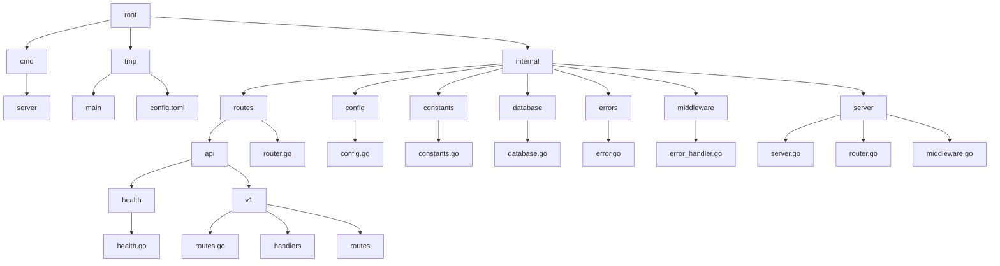

# Poverty CMS

Poverty is a simple CMS for small websites. It is designed to be easy to use. It is written in Go and uses PostgreSQL as a database.

## Requirements

- Go 1.23 or later
- PostgreSQL 16 or later
- Air (for development)

## File Structure

## WIP

I think that Medusa already has a tool to generate a token. As long as the SECRET_KEYs match, we should be able to use it to generate (or use an exsting) token for Poverty.
Have Jordan see if he can send a request to Poverty from Medusa. Needs a button UI to activate the request.
